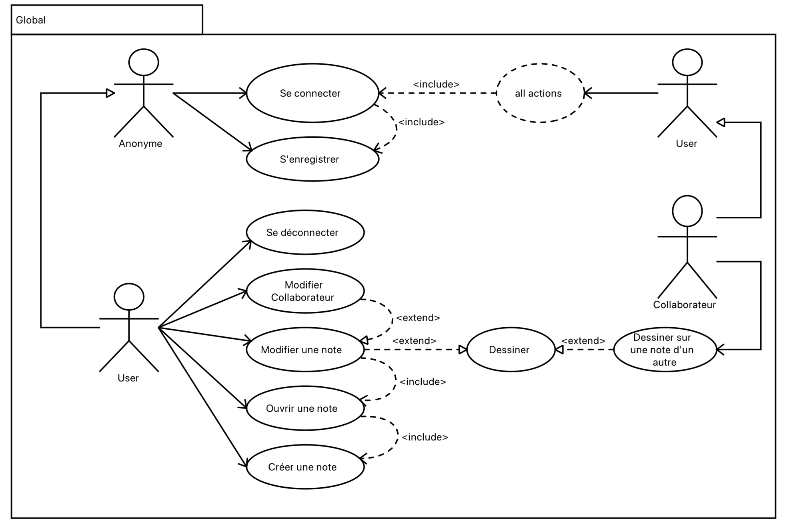
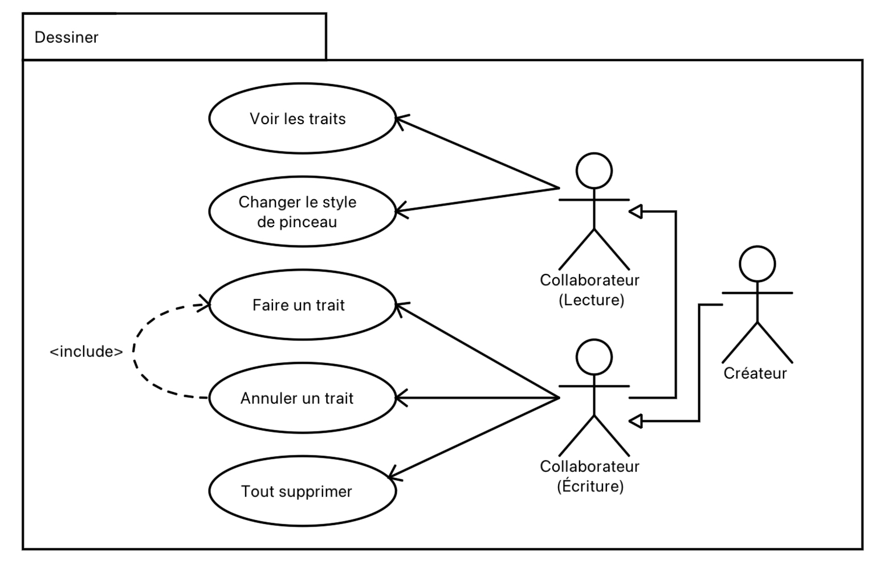
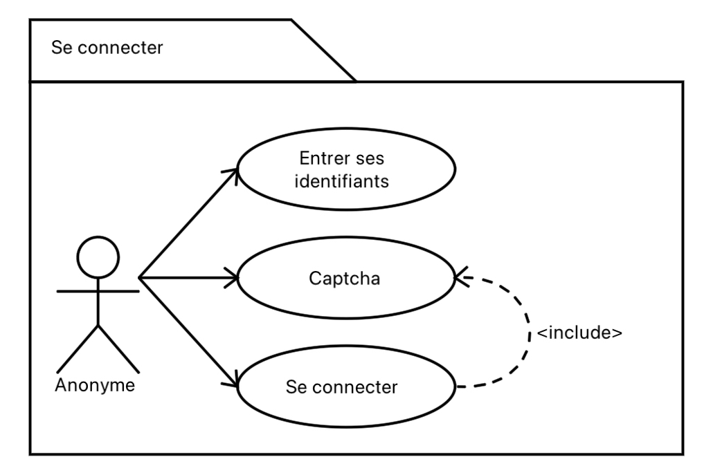
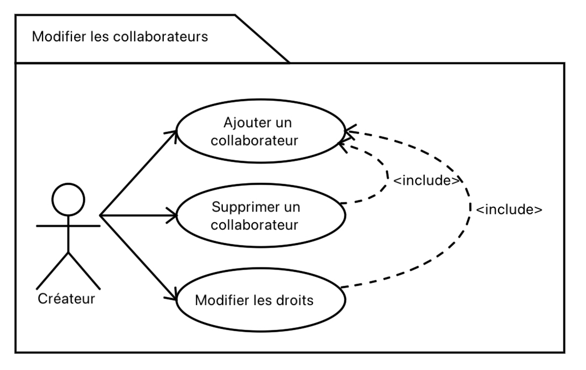
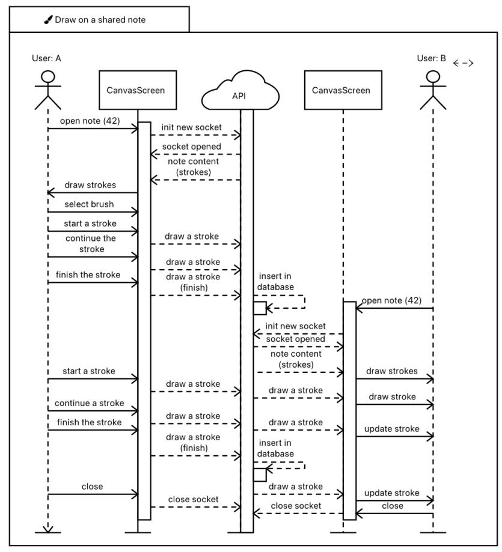
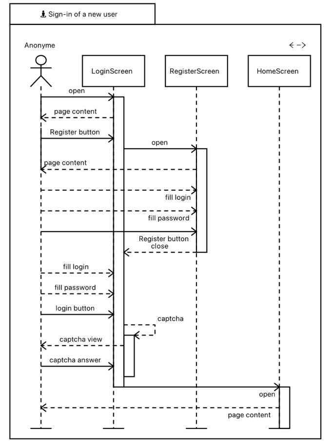
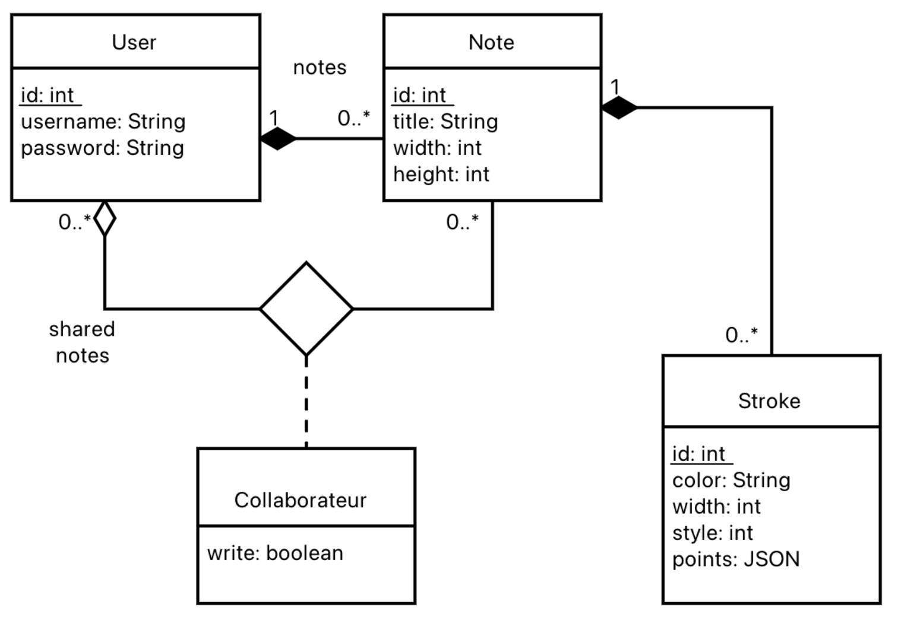

# TwoNotes

## Objectifs

TwoNotes est une application mobile pour ios et android de notes partagées.
Elle permet de créer des notes et ajouter des colaborateurs en lecture seule ou en lecture et écriture.
Les colaborateurs de la note ont chacun la possibilité de **undo** et **redo** leur traits et peuvent aussi supprimer le contenu d'une note avec **reset**. **Save** permet de sauvegarder la note actuelle en SVG (toujours en développement).

## Obtenir l'application

- Un click sur les badges release-app et release-ios permettent de directement télécharger l'application pour l'installer ensuite sur un téléphone. Pour IOS il faut que l'appareil utilisé soit dans la liste des appareils autorisés lors de la signature.
- Les fichiers sont également disponibles dans pages.

## Cas d'usages

### Cas d'usage global

La bulle "**All actions**" dans le diagramme (situé en haut à droite) représente les différentes actions réalisable par l'Utilisateur (User).
En effet, un Utilisateur doit s'être préablement connecté et donc disposer d'un compte utilisateur sur l'application avant de pouvoir réaliser quelconque actions.

### Cas d'usage dessin

Un créateur est un Utilisateur (User) qui a crée une note. Il a donc des droits sur celle-ci comme l'ajout de nouveau collaborateurs.
C'est droit sont détaillés sur le diagramme de cas d'utilisation ci-dessus.

### Cas d'usage connexion

Un annonyme est toute personne utilisant l'application sans être connecté. Il devient automatiquement Utilisateur (User) lorsqu'il est connecté. En tant qu'annonyme, seul les pages de connexion et d'inscription sont disponible.

### Cas d'usage de la modification d'un collaborateur

Un collaborateur est un Utilisateur (User) qui a été invité à la lecture (et potentiellement l'écriture) par un Créateur sur une de ces notes personnels.  
Ainsi un Utilisateur peut avoir en même temps le rôle de Collaborateur et Créateur sur l'application. Toutefois, il ne peut pas l'être sur la même note.
En effet, si il a crée la note il sera Créateur mais ne pourra pas devenir Collaborateur.

## Scenarii d'usage

### Dessin dans une note partagée

### Register et login d'un utilisateur de l'application

## Diagramme de classe

## Documentation API

La documentation est accessible sous le lien suivant : https://two-notes.herokuapp.com/doc/
Elle est gérérée automatiquement avec swagger.

## Choix techniques réalisés

### Front : APP

Nous avons commencé au début du projet à utiliser expo pour avoir rapidement accès à l'application sur Android et iOS en même temps. Nous avons par la suite enlevé expo du projet pour utiliser une librairie récente qui n'était pas disponible avec expo.

Nous avons utilisé Typescript sur l'application pour avoir du typage et rendre le code plus maintenable.
Pour le linting, nous avons choisi d'utiliser ESLint et Prettier.

Par manque de temps, nous avons choisi de ne pas faire de tests Detox.

Concernant l'organisation de l'application :

- Dossier **screens** : Nos différentes pages.
- Dossier **components** : Les différents composants que nous avons créé. Il y en a très peu car nous n'avions pas spécialement besoin de les réutiliser ailleurs dans le code et les pages ne sont pas très grandes.
- Dossier **canvas** : Contient des constantes et des fonctions utilitaires utilisées dans les composants liés au canvas.
- Dossier **constants** : Les constantes sur le layout et les couleurs.
- Dossier **navigation** : L'organisation des pages de l'application avec la gestion de ce qui est visible en fonction de l'authentification.
- Dossier **hooks** : Les hook pour les couleurs.
- Dossier **utils** : Utilitaire pour gérer le token, le nom et le mot de passe de l'utilisateur.
- Dossier **Assets.xcassets** : Pour le logo de l'app.

### Backend : API

Nous avons choisi d'utiliser Sequelize avec SQLite pour la DB car c'est ce que nous avions vu en cours. De plus, le modèle de base de données relationnel correspondait bien au projet. Le backend est une API REST avec des sockets pour la gestion des traits sur les notes partagées. Les traits sont transmis à chaque personne connectée sur la même note en temps réel. Un trait est sauvegardé en base de données uniquement à la fin quand l'utilisateur le relache/fini. Ainsi, nous évitons de faire des modifications dans la base de données à chaque changement lorsque l'utilisateur trace le trait.

Pour avoir une documentation automatique de l'API, nous avons utilisé swagger.

Nous avons implémenté un middleware pour gérer le token pour tous les endpoints.

Le linting est aussi réalisé avec ESLint et Prettier comme dans le front.

Pour tester les endpoints, nous utilisons JEST. La seule feature qui n'est pas testée est le captcha (reCaptcha) qui permet de tester que ce n'est pas un robot qui se connecte à l'API.

Le captcha fonctionne grâce à l'utilisateur de l'API de Google reCaptcha et comble le pré-requis du projet en terme d'utilisation d'API externe.

### Gestion des rôles

Dans l'application un utilisateur peut être un **créateur** et/ou un **collaborateur**.
Il est **créateur** lorsqu'il crée une note. Il peut ensuite vouloir partager la note en lecture et écriture ou juste en lecture à un **collaborateur**. Le rôle **collaborateur** permet à un utilisateur d'accéder à une note qu'un autre utilisateur lui a partagé avec différents droits.

Les droits sont très simple, il y a juste un boolean avec le droit d'écriture ou non pour le collaborateur.

## Démonstration vidéo

https://www.youtube.com/watch?v=Y7Bk75WKeDg

Une fonctionnalité a été ajouté après la vidéo pour voir si nous sommes on non en **readonly** sur une note. Cette fonctionnalité est présente sous la forme d'un texte présent sur le haut de la note.

## Organisation de l'équipe

Tout le monde a travaillé à un moment donné sur le backend et le frontend. Nous avons utilisé le board de gitlab et les issues pour se répartir les tâches et faire un seul sprint SCRUM. Chaque issue avait un poids et était attribué à une ou plusieurs personnes.

L'API REST à principalement été développé par Nicolas. Il a construit la base de donnée SQLite pour les notes, les utilisateurs et collaborateurs. Il s'est aussi occupé de faire certaines pages sur l'ajout de note et de collaborateur avec la gestion de l'affichage en fonction de l'authentification. Il s'est également occupé de la gestion iOS à savoir faire le build ios et la signature ios sur la pipeline ci-cd, etc..

Hugo a amélioré une librairie de dessin qu'il a fork sur son Github : [github.com/BlueskyFR/rn-perfect-sketch-canvas](https://github.com/BlueskyFR/rn-perfect-sketch-canvas). Dans un premier temps, afin de prendre en compte une gestion du dessin par le réseau, la gestion de l'historique (undo/redo) a été réécrite pour indexer les traits par IDs (+ style : color, width...), en stockant seulement les deltas (différences entre 2 états du canvas) ; des callbacks ont été ajoutés pour avoir des informations lorsqu'une action était réalisé (`onDraw(bool)`, `onDelete(bool)`) : le serveur peut se servir du booléen dans `onDraw(bool)` pour savoir quand un trait est fini et ainsi le stocker en base de données; ensuite, les fonctions d'importations et d'exportation de traits (save, load) ont été mises à jour.
Une méthode `delete(id)` a également été ajoutée pour permettre de supprimer un trait en spécifiant son ID.
Enfin, une option **readonly** a été ajoutée pour permettre d'interdire des nouveaux traits sur le canvas afin qu'il puisse être utilisé en tant qu'"invité" par exemple.
Ces modifications ont également amélioré les performances et ont réduit l'espace mémoire consommé par la librairie.
L'ensemble de ces modifications a été une vraie expérience de reprise d'un code existant tout en améliorant, facilitée par l'utlisation des types Typescript par l'auteur original, qui ont été mis à jour par la même occasion.
Les modifications que nous avons pu faire ayant ajouté de nombreuses fonctionnalités au projet initial, nous avons l'intention de les proposer à l'auteur original sous la forme d'une **pull request**.
Les modifications effectuées peuvent être consultées facilement en consultant l'historique des commits, résumant bien ce qui a été fait.

Hugo a aussi réalisé le build APK de la pipeline CI-CD. Il s'est enfin occupé de faire la communication des sockets côté front.

Tanguy a développé des pages (register, login, Home) pour l'application. Il s'est occupé d'ajouter à la pipeline les badges, le linting, les tests backend et le déploiement sur Heroku de l'api. Il a aussi ajouté à la base de donnée les traits et leur gestion avec les sockets en backend.
